# FlowSui

[English](#english) | [日本語](#japanese)

---

## 🌍 English

### Usage & Commercial Projects

You are free to use, modify, and redistribute this software in accordance with the terms of the Apache License 2.0.

If you use this software in a public project, commercial product, plugin, or other published work, I would greatly appreciate it if you let me know.

There is no obligation to contact me, but I would genuinely love to see how my work is being used. I may also feature or share interesting projects with appropriate credit, with the author's permission.

If you use this project in a commercial product, you are not required to share any revenue with me under this license.

Please retain the original copyright notice, license, and attribution notices when redistributing this software or substantial portions of it, as required by the Apache-2.0 License.

### Maintenance

This project is provided as-is, without warranties or conditions of any kind.

It may not receive regular updates or maintenance. Compatibility with future versions of the target software is not guaranteed.

### Contributing

Feel free to fork, modify, or build upon this project under the terms of the Apache License 2.0.

If you make improvements or fixes that you think would benefit the project, pull requests are very welcome. There is no guarantee that every contribution will be merged, but I would be happy to review them. 
*(Note: Contributions submitted to this project are also subject to the Apache-2.0 license terms.)*

## ✨ Features ＆ How to use
English localization is currently not supported. It might be added in the future, depending on mood. Pull requests are very welcome!  
A team operation feature using GitHub is also included so that multiple people can work together. See [Sync & Git](#GitSync-en) for details.

### HOME
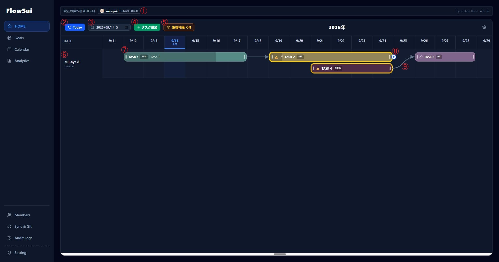
- **1.** Currently logged-in user.
- **2.** Click the **Today** button to jump back to the current day.
- **3.** Select a specific date to jump to that day.
- **4.** Click this button to add a task. Alternatively, you can double-click on any empty space to create one.
- **5.** Click this button to toggle whether to show yellow borders and warning marks (⚠️) for overlapping tasks.
- **6.** Each user is displayed in a column on the left side.
- **7.** Drag tasks to move them, or grab the left/right bars to extend or shorten them.
- **8.** Grab the dot on the far left edge and drag-and-drop it onto another task to connect them with an arrow.
- **9.** Click an arrow to open a pop-up asking if you want to delete it; click OK to remove the arrow.

### Goals
There are two types of goals: **Month Goals** (monthly goals) and **Long Goals** (yearly goals).
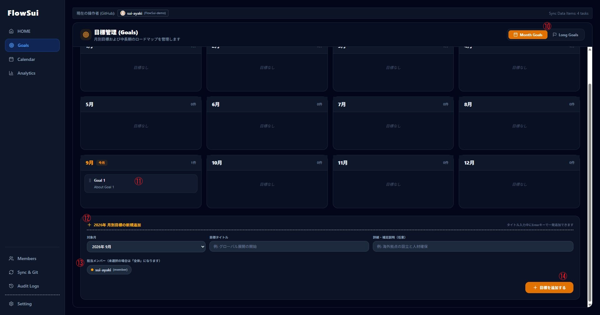
- **10.** Switch between Month Goals and Long Goals.
- **11.** Drag and drop to change the month. You can also delete or edit from here.
- **12.** Configure the settings here and press ⑭ to add a goal. From left to right: target month, goal title, and description/memo.
- **13.** Select a person here to assign the goal to them. If left unselected, the target scope is recognized as everyone.
- **14.** Click this button to add a goal.

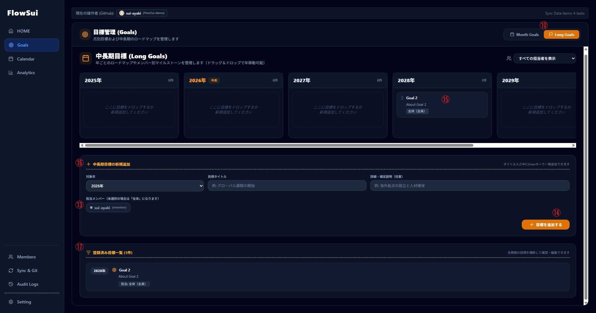
- **15.** Drag and drop to change the year. You can also delete or edit from here.
- **16.** Configure the settings here and press ⑭ to add a goal. From left to right: target year, goal title, and description/memo.
- **17.** View the added yearly tasks in a list format.

### Calendar
You can switch between **Week**, **Month**, and **Year** views in the Calendar.
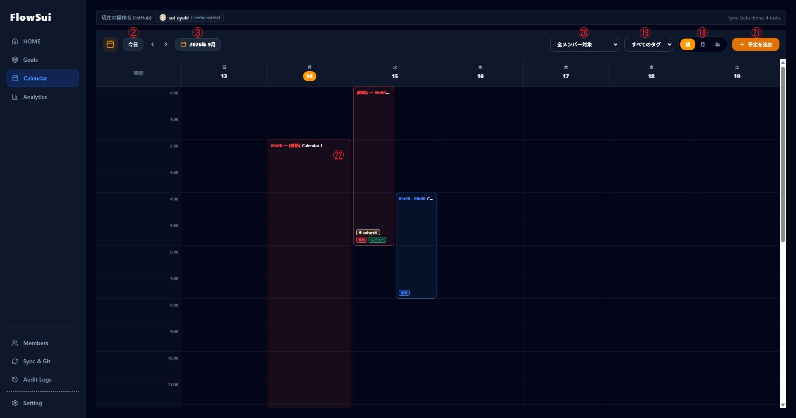
- **18.** Switch between **WEEK / MONTH / YEAR**.
- **19.** Sort the calendar by **TAG**.
- **20.** Sort the calendar by **MEMBER**.
- **21.** Click this button to add a schedule/event. Alternatively, double-click on any empty space to create one.
- **22.** Event colors can be changed. You can also assign responsible members or tags.

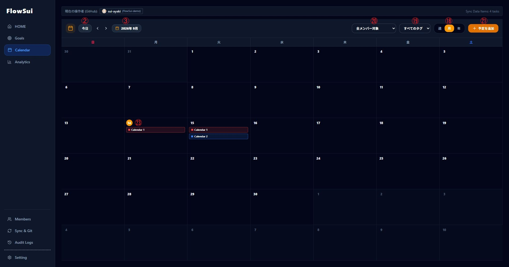
- **23.** Colors are reflected. Click a day number to move to the **WEEK** view containing that day.

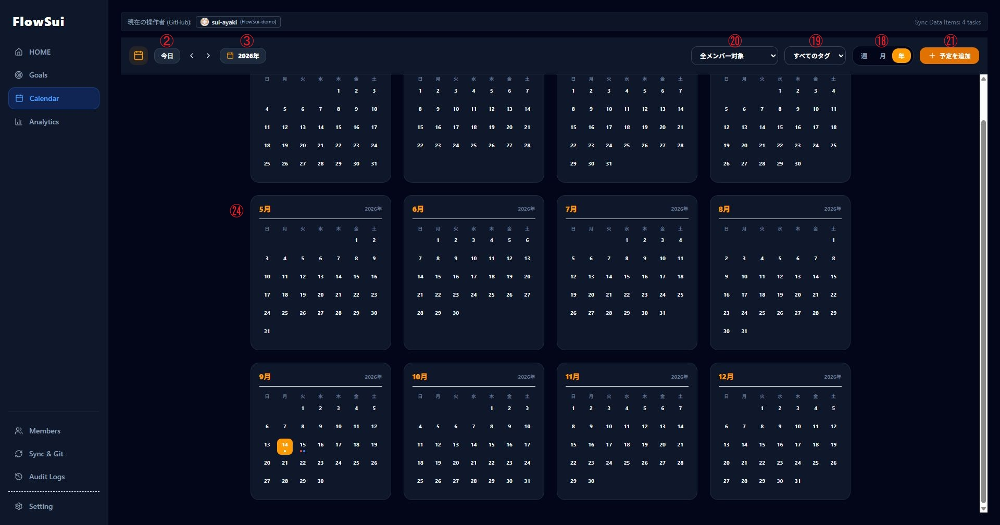
- **24.** Colors are reflected. Dots representing the number of events are displayed. Click a month to move to the **MONTH** view.

### Analytics
Although called Analytics, the workload/utilization rate is a rough estimate and has low reliability.
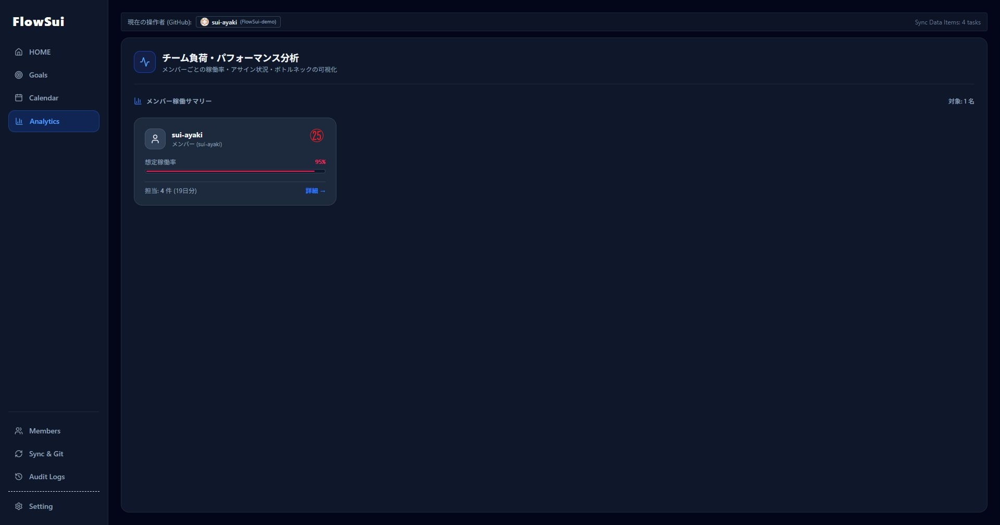
- **25.** Member names, roles, and utilization rates are displayed in a card format.

- **26.** Click this button to return to the card-format view.
- **27.** The currently viewed member. This is a dropdown; selecting someone switches to their detail view.
- **28.** Warnings regarding schedule overlaps and other details are displayed.
- **29.** A list of tasks currently assigned to that person is displayed, along with their duration.

### Members
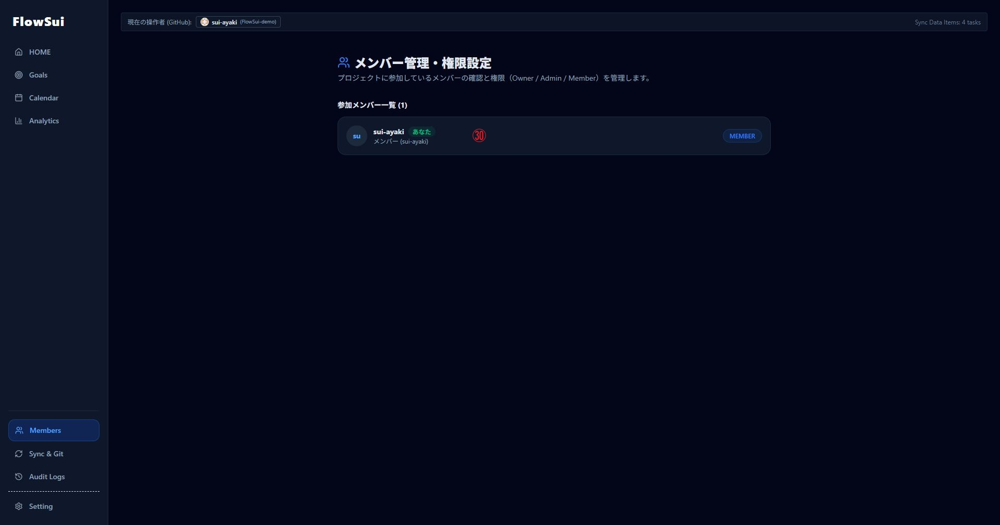
- **30.** Displays current team members and their roles. Owners can change roles and delete users.

### Sync & Git
This configuration must be performed whether you are using the app individually or as a team.
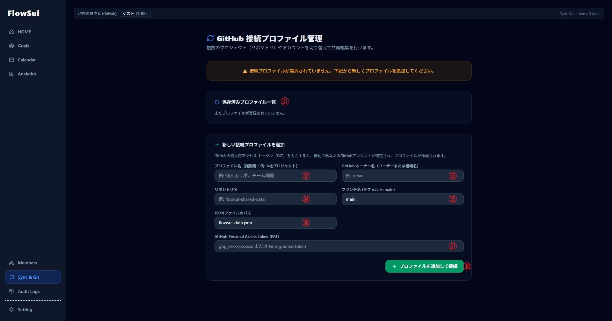
- **31.** Displays the profiles you have created. Multiple profiles can be registered and switched.
- **32.** Profile name. You can name it freely.
- **33.** The owner name of the GitHub repository used for synchronization. (When using as a team, private repositories require the owner to invite you as a collaborator in advance).
- **34.** The name of the GitHub repository used for synchronization.
- **35.** The name of the branch created in the GitHub repository. `main` is recommended if you have no specific preference.
- **36.** The path to the JSON file. The default value should be fine unless you have specific preferences.
- **37.** Input field for the GitHub Personal Access Token. **Classic tokens are recommended**, as Fine-grained tokens have not been verified. Even when working in a team, each user must input their own token created from their personal account; repository owners do not need to share tokens. When creating a token, you must check `repo` and `user`.
- **38.** Click this button to register as a profile.

### Audit Logs
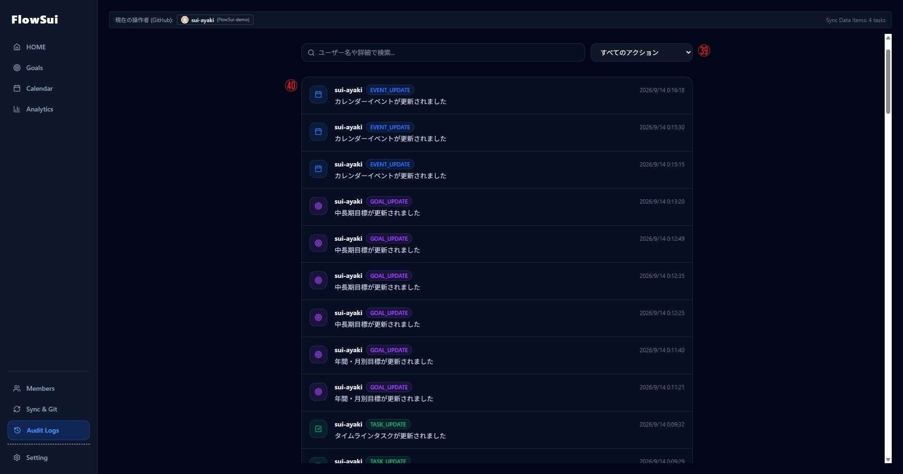
- **39.** Filter changes by category (**Event / Task / Goal / Member / Sync**).
- **40.** Records who made the change and what was targeted. A system to record detailed diffs has not been implemented yet.

### Setting
There are **General Settings** (system-wide settings that only Owners and Admins can configure) and **Personal Settings** (configured and saved individually per user).

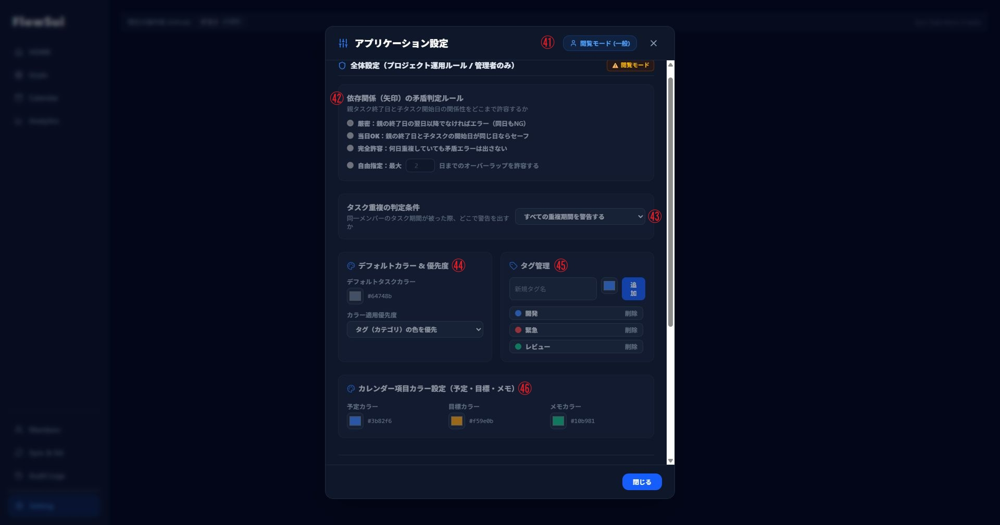
- **41.** Your current role. If you don't have access to general settings, it appears grayed out without editing permissions.
- **42.** Sets the overlap tolerance for dependent tasks (connected by arrows):
  - **厳密:** OK starting the day after the parent task ends (same-day overlap is not allowed). Overlaps beyond this result in an error (red arrow).
  - **当日OK:** OK starting on the parent task's end day. Overlaps beyond this result in an error (red arrow).
  - **完全許諾:** No errors are thrown regardless of how many days overlap. In other words, arrows will never turn red.
  - **自由指定:** You can manually specify how many days of overlap are permitted. Overlaps beyond that result in an error (red arrow).
- **43.** Choose whether task overlap warnings apply to all tasks or only tasks sharing the same **TAG**. (Default is the former).
- **44.** Default task color settings. The dropdown below determines whether tag colors or individual task colors take priority when a tag is applied. (Default is tag color priority).
- **45.** Create tags here. These tags are shared across tasks, calendars, and goals (presumably). From left to right: Tag name, color, and add button. Click the gray text ("削除") to remove a tag.
- **46.** Color settings for calendar items. From left to right: Event color, Goal color, and Memo color.

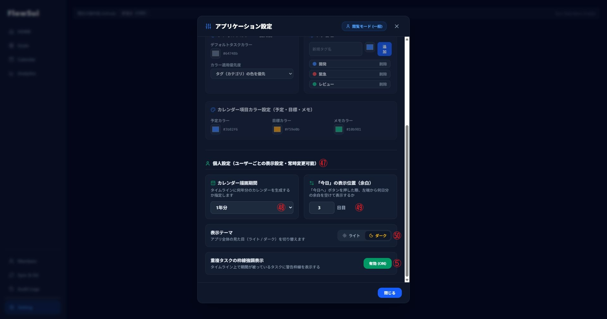
- **47.** Personal settings section.
- **48.** Set how many years of tasks to display.
- **49.** Set how many days of blank space to leave to the left of "Today" (i.e., how many days of past history are visible by default).
- **50.** Toggle between **Light Mode** and **Dark Mode**. Light mode is the default (left side).

### 📥 Installation
Download the latest `setup.exe` or `.msi` from the [Releases](https://github.com/sui-ayaki/FlowSui/releases) page.

### 📜 License
This project is licensed under the Apache License 2.0 - see the [LICENSE](LICENSE) file for details.

Copyright (c) 2026 水 彩晶 (sui ayaki)

---

## 🇯🇵 日本語

### 利用と商用プロジェクト

このソフトウェアは、Apache License 2.0の条件に従って、自由に使用、改変、再配布することができます。

もしこのソフトウェアを公開プロジェクト、商用製品、プラグイン、その他の公開される成果物で使用される場合は、ご一報いただけると大変嬉しいです。

ご連絡いただく義務はありませんが、自分の作品がどのように使われているのか、純粋にとても興味があります。また、作者の許可を得た上で、面白いプロジェクトを適切なクレジット表記とともに紹介・シェアさせていただくこともあります。

商用製品で使用する場合でも、このライセンスの下で収益を私とシェアする必要はありません。

このソフトウェアまたはその大部分を再配布する際は、Apache-2.0ライセンスの求めに従い、元の著作権表示、ライセンス、および帰属表示を保持してください。

### メンテナンス

This project is provided as-is, without warranties or conditions of any kind.

定期的なアップデートやメンテナンスは行われない場合があります。また、対象ソフトウェアの将来のバージョンとの互換性は保証されない場合があります。

### コントリビューション（貢献）

Apache-2.0ライセンスの条件の下で、自由にフォーク、改変、またはこのプロジェクトをベースにした開発を行ってください。

プロジェクトの利益になると考える改善や修正を行った場合は、プルリクエストを大歓迎します。すべてのコントリビューションがマージされる保証はありませんが、喜んでレビューさせていただきます。
*(※このプロジェクトに提出されたコントリビューションも、Apache-2.0ライセンスの条件に準拠するものとみなされます。)*

### ✨ 主な機能と使い方
アプリ内の英語の対応は未対応。そのうち追加したいと思っているが、気分次第。Pull request大歓迎。
複数人で動かすこともできるようにgithubを使ったチーム運用機能も搭載してる。[Sync ＆ Git](#GitSync-jp)を参照

#### HOME

- **1.** 現在ログインしているユーザー
- **2.** Todayボタンを押すと今日現在に戻る
- **3.** 日付を選択してその日に飛ぶことができる
- **4.** このボタンを押すことでタスクを追加することができる。それ以外にも空欄でダブルクリックすることでも作成できる
- **5.** このボタンを押すことで重複しているタスクに対して黄色枠線と⚠️マークを表示させるかどうかの切り替えができる
- **6.** 各ユーザーが左側に列でひょうじされる
- **7.** Taskをつかむことで移動させたり、左右のバーを持つことで引き延ばしたり縮めたりすることができる
- **8.** 左端の円あたりをつかみTaskの上にドラッグアンドドロップすることで矢印でつなぐことができる
- **9.** 矢印をクリックすると矢印を削除するかどうかのポップアップが出てくるためOKを押すことで矢印を削除できる

#### Goals
Month GoalsとLong Goalsの二つがあり、Month Goalsは月単位の目標を割り当てることができる。Long Goalsでは年単位の目標を割り当てることができる。

- **10.** Month GoalsとLong Goalsの切り替えをすることができる
- **11.** ドラッグアンドドロップをして月を移動することができる。ここから削除や編集をすることもできる
- **12.** ここの設定をして⑭を押すことで目標を追加することができる。左から、追加する月、目標タイトル、説明やメモ等の順である
- **13.** ここで人を選択することで目標の対象となる人を追加することができる。選択しないと対象範囲は全員として認識される
- **14.** このボタンを押すことで目標を追加することができる

- **15.** ドラッグアンドドロップをして年を移動することができる。ここから削除や編集をすることもできる
- **16.** ここの設定をして⑭を押すことで目標を追加することができる。左から、追加する月、目標タイトル、説明やメモ等の順である
- **17.** 追加した年タスクをリストで見ることができる

#### Calendar
CalendarではWeekとMonthとYearを切り替えることができる

- **18.** WEEK / MONTH / YEAR の切り替えができる
- **19.** TAGでCalendarをソートすることができる
- **20.** MEMBERでCalendarをソートすることができる
- **21.** このボタンを押すことで予定を追加することができる。それ以外にも空欄でダブルクリックすることでも作成できる
- **22.** 予定は色を変えることができる。また、担当となる人やTAGをつけることができる

- **23.** 色は反映される。日付の数字を押すことで、その日が含まれているWEEKに移ることができる

- **24.** 色は反映される。また、予定の数、点が表示される。月の部分を押すことでMONTHへと移ることができる

#### Analytics
Analyticsとは言っているが、稼働率はなんちゃってなので信憑性は薄い

- **25.** メンバー名、ロール、稼働率がカード形式で表示される

詳細を押すことで以下の表示へと遷移される

- **26.** このボタンを押すことでカード形式で表示されている画面へと戻ることができる
- **27.** 現在見ているメンバー。ドロップダウンになっており、人を選択することで選択した人の詳細画面へと切り替わる
- **28.** 期間重複による警告等が表示される
- **29.** 今その人にアサインされているタスクが一覧で表示される。ついでに期間も表示される

#### Members

- **30.** 現在チームとして参加してるメンバーが見える。ついでにロールも表示される。Ownerはロールの変更、ユーザーの削除等を行える

#### Sync ＆ Git
個人で使用する際も、チームで運用する際もこの設定はすること

- **31.** 自分で作成したプロファイルが表示される。複数登録、切り替え可能
- **32.** プロファイル名。自分で自由に決めてよい
- **33.** 同期等を行う際のGithubリポジトリを作成したオーナーの名前。(複数人で、チームで使う際、プライベートリポジトリは事前にコラボレーターとしてリポジトリに招待してもらう必要がある)
- **34.** 同期等を行う際のGithubリポジトリの名前
- **35.** 同期等を行う際のGithubリポジトリに作成されるブランチの名前。特にこだわりがない場合はmainでいいと思われる
- **36.** Jsonファイルのパス。これも特にこだわりがない場合はデフォルトのままでOKだと思われる
- **37.** Github Personal Access Tokenの入力欄。Fine-grained tokenでは未検証のため、Classic token推奨。なお、チームで運用する際もここは各自、自分のアカウントで作成したtokenを入力すること。リポジトリのオーナーがtokenを共有する必要はない。また、作成する際は`repo`と`user`にチェックを入れる必要がある
- **38.** このボタンを押すことでプロファイルとして登録される

#### Audit Logs

- **39.** 変更内容を絞り込みができる( Event / Task / Goal / Member / Sync )
- **40.** 変更を加えた人、変更を加えた対称が記録される。詳細を記録するシステムは作成できてない

#### Setting
OwnerとAdminのみ設定することができる全体に関する設定(全体設定)と個人ごとに変更ができ、個人ごとに設定が保存される個人設定がある

- **41.** 今の自分の権限。全体設定にアクセスできない場合は灰色でそもそも編集権限がない
- **42.** 矢印でつながってるもの(依存関係)に対して、どこまでを重複として許すかという設定(上から以下のようになる)
  - **厳密** : 親のタスクの終了日の次の日からOK(同日を許さない)。それより重なるとエラー(矢印が赤色)になる
  - **当日OK** : 親のタスクの終了日からOK。それより重なるとエラー(矢印が赤色)になる
  - **完全許容** : 何日かぶっていようとエラーを出さない。すなわち、矢印が赤色になることはない
  - **自由指定** : 何日までのオーバーラップをきょかするか自分で決めることができる。それより重なるとエラー(矢印が赤色)になる
- **43.** タスクがかぶっている際、警告を出すのはすべてのタスクに関してか、それとも同じTAGで被っている者のみか。デフォルトは前者
- **44.** デフォルトのタスクの色の設定。下のドロップダウンはTAGを付けた際にTAGの色とタスクごとに設定した色のどちらを優先するかの設定。デフォルトはTAGの色優先
- **45.** TAGをここから作成することができる。このタグはタスク、カレンダー、目標すべて共通(なはず)。左から、TAGの名前、色、追加ボタン。灰色の文字(削除)を押せば消すことができる
- **46.** カレンダーの項目の色の設定。左から、予定カラー、目標カラー、メモカラーの順

- **47.** ここから個人設定
- **48.** タスク表示の際、何年分表示するかを設定できる
- **49.** タスク表示の際、今日の左端を何日空けるかの設定(要するに過去何日分をデフォルトで見えるようにするか)
- **50.** アプリの ライトモード / ダークモード の切り替え。デフォルトではライトモード(左側)

### 📥 インストール方法
[Releases](https://github.com/sui-ayaki/FlowSui/releases) ページから最新の `setup.exe` または `.msi` をダウンロードしてインストールしてください。

### 📜 ライセンス
このプロジェクトは Apache License 2.0 の下で公開されています。詳細は [LICENSE](LICENSE) ファイルをご覧ください。

Copyright (c) 2026 水 彩晶 (sui ayaki)
